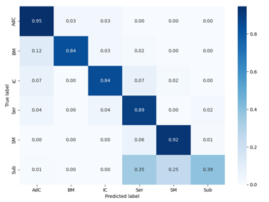
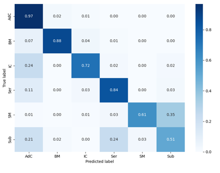

# DESI Mass Spectrometry Autoencoder Classification

## Overview

This repository contains the code for an autoencoder-based classification model for Desorption Electrospray Ionization (DESI) Mass Spectrometry data. The model aims to classify DESI mass spectra into different classes using an autoencoder architecture.

## Table of Contents

- [Introduction](#introduction)
- [Installation](#installation)
- [Usage](#usage)
- [Dataset](#dataset)
- [Results](#results)
- [Contributing](#contributing)

## Introduction

As a student project, this repository serves as an implementation of an autoencoder-based classification model for DESI Mass Spectrometry data. The primary goal is to explore the potential of autoencoder architectures in classifying DESI mass spectra efficiently.

## Installation

To run the code in this repository, you'll need to install the following dependencies:

- [TensorFlow](https://www.tensorflow.org/)
- [Keras](https://keras.io/)
- [scikit-learn](https://scikit-learn.org/)
- [NumPy](https://numpy.org/)
- [Pandas](https://pandas.pydata.org/)
- [Seaborn](https://seaborn.pydata.org/)
- [Matplotlib](https://matplotlib.org/)

You can install these packages using pip:

```bash
pip install tensorflow keras scikit-learn numpy pandas seaborn matplotlib
```
## Usage

1. Preprocess the DESI Mass Spectrometry data according to your requirements.
2. Train the autoencoder classification model using the provided scripts.
3. Evaluate the model's performance on a test dataset.
4. Experiment with hyperparameters and model architectures to improve classification accuracy.

## Dataset

The DESI Mass Spectrometry dataset used in this project consists of labeled mass spectra. Each data point in the dataset represents a mass spectrum acquired from DESI Mass Spectrometry, accompanied by a corresponding label indicating the class or category to which it belongs.

### Features

The features of each data point (mass spectrum) typically include:

- **Mass Peaks**: Intensity values corresponding to mass peaks observed in the spectrum.
- **Mass-to-Charge Ratio (m/z)**: The mass-to-charge ratio of ions detected in the mass spectrum.
- **Tissue Labels**: Some samples in the dataset are labeled with the type of tissue they were obtained from. Tissue labels provide additional context to the mass spectra and can be used for certain analyses or classification tasks.

Examples of tissue labels in the dataset include:

- Brain tissue
- Liver tissue
- Kidney tissue
- Lung tissue
- Breast tissue

### Labels

The dataset is labeled, meaning each mass spectrum is associated with a specific class or category. These labels are used for training and evaluating the autoencoder classification model.

### Dataset Availability
Please note that the DESI Mass Spectrometry dataset used in this project is not publicly available due to privacy considerations.

## Results

Here are some visualizations of the results obtained from the model:


*Figure 1: Autoencoder and classification training with labeled data. Here we achieved an F1 score of 0.77 and an accuracy of 0.85*


*Figure 2: Autoencoder and classification training without labeled data. Here we achieved an F1 score of 0.72 an accuracy of 0.77*

## Contributing

Contributions to this project are welcome. If you have any suggestions, improvements, or bug fixes, feel free to open an issue or create a pull request.
